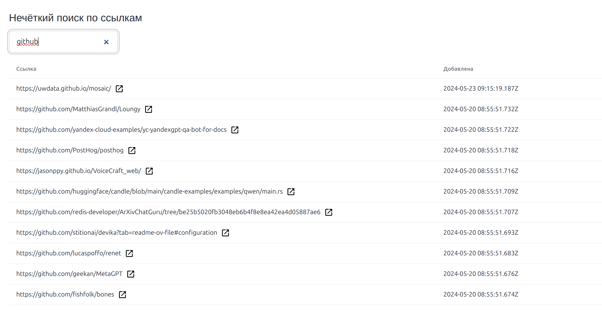
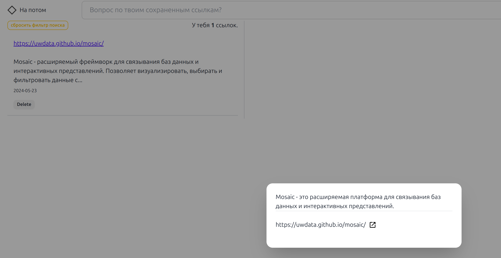
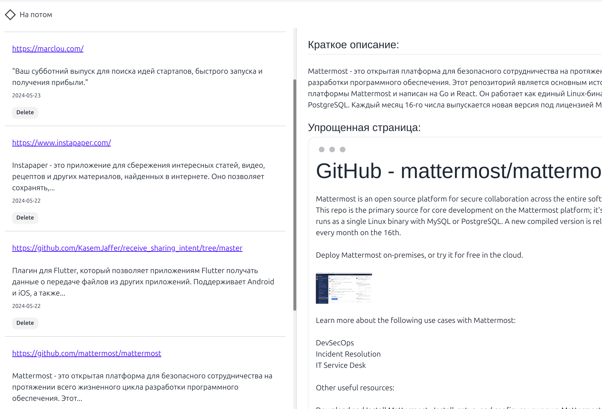

Что если букмарк лист скрестить с ChatGPT. Ваши ссылки станет быстро найти. Будет легко узнать ответ на вопрос по существу, что в этой ссылке описывается. Вам больше не надо особо структурировать ссылки. Если нужно вспомнить, что вы сохраняли, можно просто спросить ИИ.

Добро пожаловать в Альфа версию такого Bookmark аппа "Напотом" от Rupilot.
[Перейти в апп](https://napotom.zatsepin.dev)

<!--truncate-->

ChatGPT дал старт новому поколению небольших приложений. Раньше небольшие аппки решали задачи за счет интересного UI или формфактора устройства (эпоха мобильных приложений), всяких читалок, календарей, тудушек наплодилось много. В сторы уже с таким просто и не войти. Но LLM дает возможность переоценить старый подход ко всем этим аппкам. Время писать новые!

# Сервис Напотом

Он решает задачу, которую сейчас принято решать с помощью Telegram. Встречается интересная статья или лэдинг, приложение и вы закидываете такую ссылку себе в Telegram "Saved Messages". Потом если сразу не посмотреть, то просто забывается.

В Напотом можно добавлять ссылки. И они сохраняются для вашего профиля. Каждый раз когда вы добавили ссылку, сервис скачивает и структурирует информацию с вашей ссылки. После чего ее можно найти, просто спросив ИИ любую тему касательно содержания ссылки.
А еще Напотом делает краткое описание содержимого и представляет содержимое ссылки в легко читаемой форме. Можно прочитать контент без рекламы и лишнего UI сайта, либо просто ограничиться кратким содержимым.

Для граждан РФ сервис "Напотом" может скачивать и анализировать информацию с ссылок, даже если они авторами блокируются по русскому IP. (Digital Ocean, Medium и тп ...)

Альфа версия, уже умеет в векторизацию и скрапинг страниц. Видео ссылки еще не доступны. Она умеет в поиск и нечеткий поиск.

## Возможности

- Нечеткий поиск
  
- Спросить ИИ по существу
  
- Краткое содержание и Читалка для статьи
  

## Шорткаты

```
ctrl+k - Задать вопрос по ссылкам
ctrl+o - Добавить новую ссылку
ctrl+p - Нечеткий поиск по названию ссылки
```
